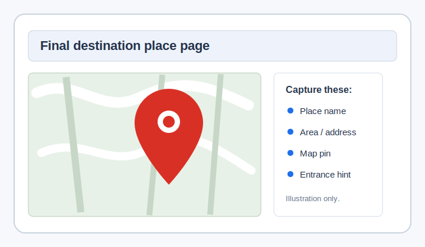
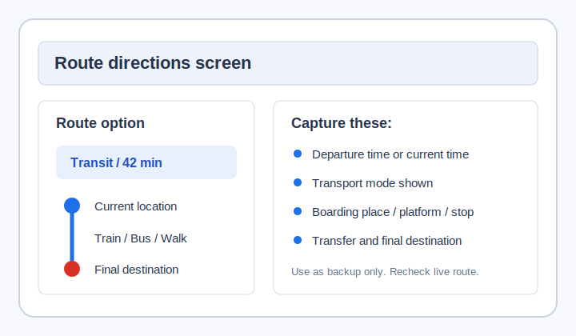

# 旅行前のGoogle Maps控え・印刷利用ガイド

## 位置づけ

この資料は、Google Mapsで事前に調べた目的地・ルート候補・地図画面を、旅行中に人へ見せるための控えとして使う方法を整理する補足資料である。

このアプリ・サイトはGoogle Mapsの代替ではない。移動中の最新ルート、交通手段、時刻、現在地確認はGoogle Mapsで行う。一方で、旅行前に調べた情報を紙やスクショで持っておくと、通信不安、言語不安、同名地点確認、現地の人への説明に役立つ。

## 想定する使い方

旅行前、ホテル、空港、駅、Wi-Fiが安定している場所で、次の情報をGoogle Mapsや公式サイトで確認しておく。

- Final Destinationの正しい場所名
- 地域、市区町村、都道府県
- 住所の一部
- 目的地の種類
- Google Mapsのピン位置
- 入口、受付、集合場所の手がかり
- 大まかなルート候補
- 使う可能性が高い交通手段
- 終電、最終バス、地方路線の本数

そのうえで、必要なら印刷、スクショ、メモとして持っておく。

## スクショ・印刷サンプル

以下は、実際のGoogle Maps画面ではなく、旅行前にどのような情報を控えておくとよいかを示す参考用サンプルである。実サービスやWebコンテンツで使う場合は、利用者自身がGoogle Mapsで表示した画面をスクショ・印刷する前提にする。

### 目的地の場所ページ



控えておくとよい情報:

- 目的地名
- 地域、市区町村、都道府県
- 住所の一部
- Google Mapsのピン位置
- 入口、受付、集合場所の手がかり

### ルート案内ページ



控えておくとよい情報:

- 表示した時刻
- 交通手段
- 乗り場、ホーム、停留所
- 乗り換えの有無
- Final Destinationまでの大まかな流れ

ただし、このルート案内は固定の指示書として使わない。移動中は、現在地と時刻に合わせてGoogle Mapsを開き直す。

## 役立つ場面

- 通信が不安定でGoogle Mapsをすぐ開けない。
- 目的地名を英語で見せても伝わりにくい。
- 同じ名前の場所が複数あり、地域や住所を見せたい。
- ホテルスタッフ、駅員、観光案内所、周囲の人に目的地を説明したい。
- バッテリー残量が少なく、画面を何度も開けない。
- 地方や夜間で、1本逃すと移動手段が大きく変わる可能性がある。

## 注意点

紙やスクショは、固定ルートの指示書として使わない。

Google Mapsのルート、交通手段、乗り場、時刻は、現在地、時刻、運行状況によって変わる。旅行前や数時間前に見たルートと、現地で開いたルートが違うことはある。

そのため、移動を始める時、交通手段を使い終えた時、迷った時は、必ずライブのGoogle Mapsで現在地からFinal Destinationまで再確認する。

## アプリ内での扱い

Set Destinationでは、旅行前に調べた控えを使ってFinal Destinationを正しく入力してよい。

Google Maps openedでは、紙やスクショではなく、ライブのGoogle Mapsを見て次を確認する。

Show Final Destination in JPでは、控えにある場所名や地域と、アプリに入力したFinal Destinationが一致しているかを人に確認してもらう。

交通手段ページでは、紙やスクショの情報だけで乗らない。Google Mapsで表示している現在の場所、バス、電車、乗り場を人に見せて確認する。

## ユーザー向け短文

旅行前準備ページや補足ページで表示する場合は、次の短文を使う。

```text
You can prepare a Google Maps printout or screenshot before travel.
Use it as a backup to explain your destination, not as the final live route.
When you move, always check the current route again in Google Maps.
```

日本語での意味:

```text
旅行前にGoogle Mapsの印刷やスクショを用意してもよい。
目的地を説明するための控えとして使う。
移動中の正しいルートは、その時点でGoogle Mapsを開いて確認する。
```
